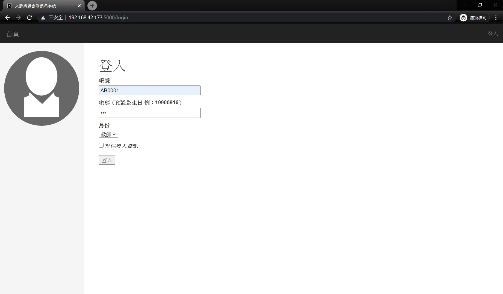
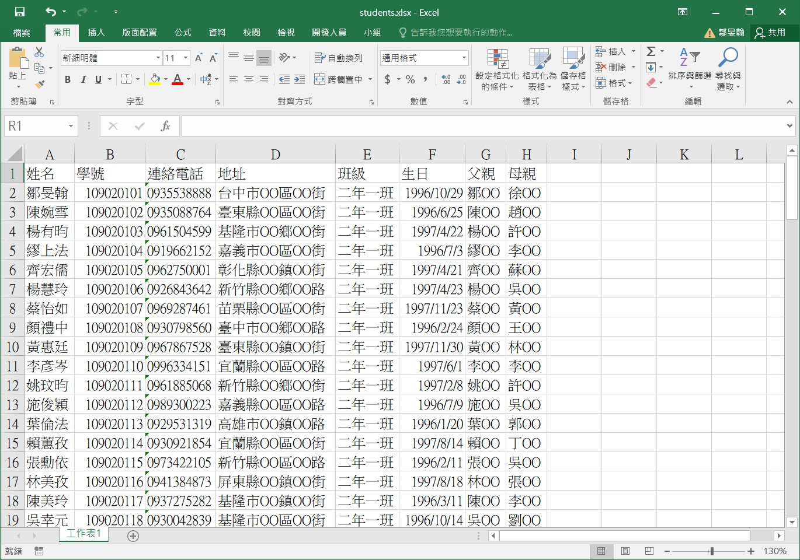
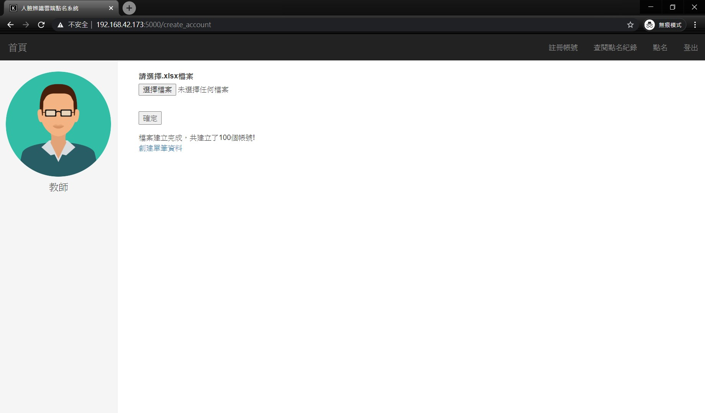
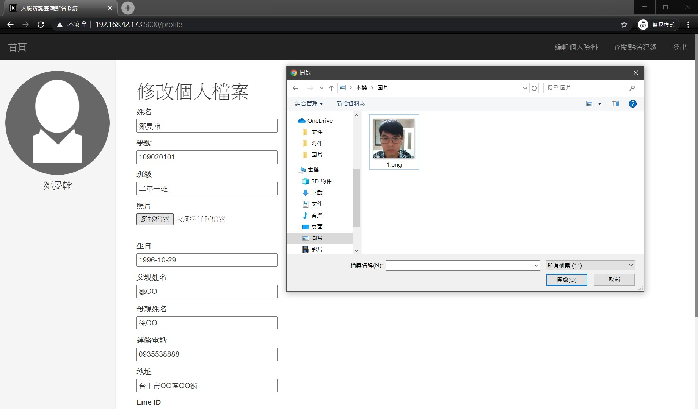
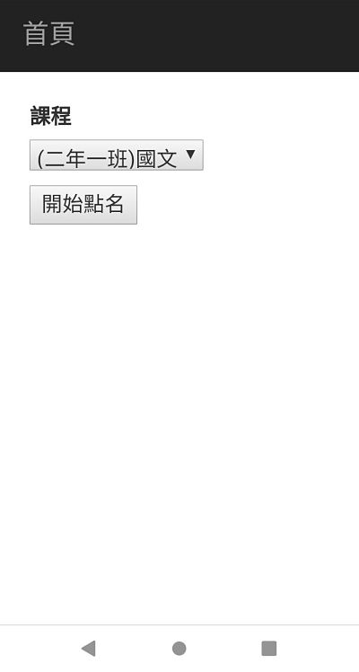
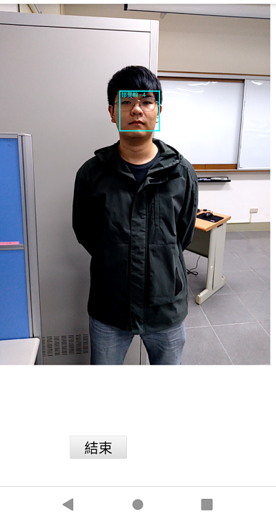
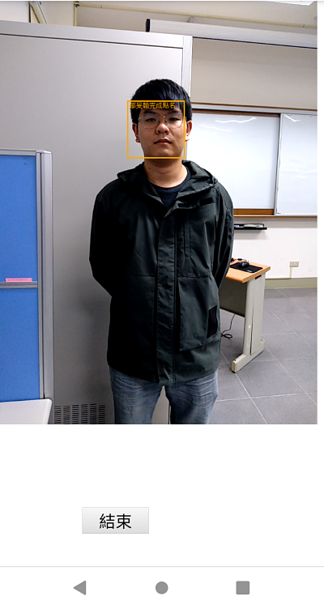
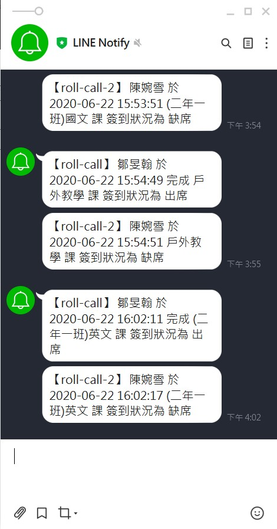
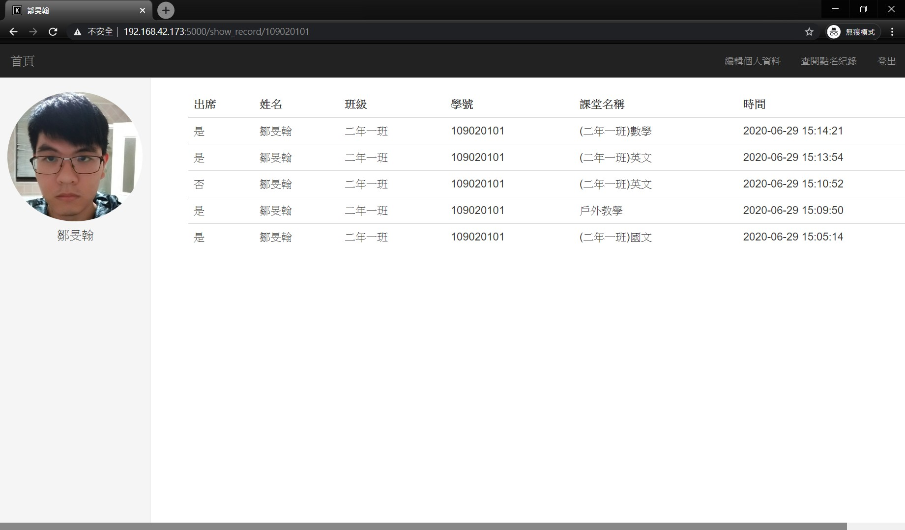
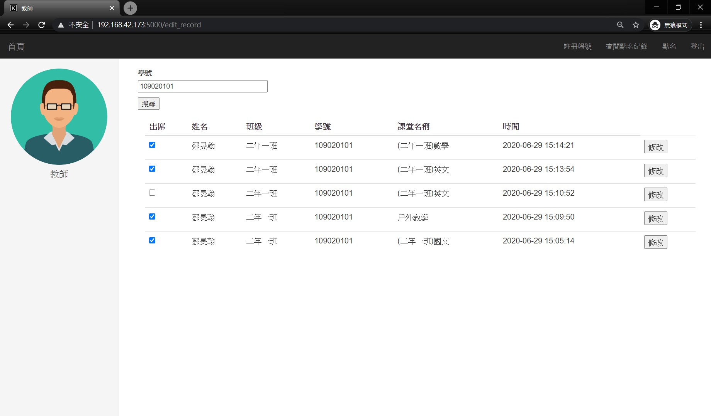

這是一個模擬學校人臉辨識點名推播系統的作品，使用Flask開發，可在手機網頁上進行操作，人臉辨識部份使用Dlib提供的模型，推播則是使用Line Notify。

## 建立學生帳號
為了使用點名的功能，校方需要建立學生的帳號，在建立帳號前必須依照欄位建立含學生資料的xlsx格式檔案，教師進入建立帳號頁面為學生建立帳號，匯入xlsx格式檔案，系統判定檔案格式為xlsx格式後自動建立所有學生帳號數據於資料庫中，反之不做任何動作並提示教師上傳檔案格式錯誤，建立完帳號後上傳相關資料（照片、Line Token等）的步驟再由學生進行操作。以該名學生的學號與生日作為帳號密碼。

### 登入教師帳號

### 準備學生相關資料
透過程式亂數產生（姓名、學號、連絡電話與地址等），將這些學生分為三個班級（二年一班、二年二班、二年三班）。

### 上傳檔案並建立學生帳號

### 學生修改個人資料
學生登入帳號後，上傳照片以及Line Token。

## 點名操作
只能由教師進行操作，教師進入點名頁面之後選取課程，點擊開始點名按鈕後，取得該堂課的修課名單並進入拍攝頁面開始進行辨識，成功辨識之同學即完成簽到動作，新增出席記錄於資料庫中並發送Line Notify訊息通知該名學生已完成簽到，其餘未完成的同學於課堂點名結束後經由系統統一發送缺席通知。

### 選取課程
手機端選擇點名課程，按下開始點名後進入人臉辨識點名畫面。

### 進行人臉辨識
進入拍攝頁面後會要求取得設備鏡頭使用權限，點選確定後開始拍攝畫面，將畫面傳輸至伺服器後端進行辨識，當辨識到人臉時會在畫面中顯示倒數秒數，當連續辨識五秒後即完成該名學生之點名，若中斷同位學生的辨識數秒鐘後則重新計算倒數秒數，以此方式排除辨識錯誤的發生，完成辨識時會顯示完成辨識之字樣，將點名資訊記錄於資料庫中並發送Line Notify通知並同時播放語音通知，隨後點選結束按鈕結束點名操作，於資料庫中記錄所有未出席之學生，並告知該名學生未出席該堂課。

### 還沒完成點名

### 完成點名

##  Line Notify發送通知訊息
roll-call 是出席的通知。
roll-call2 是缺席的通知。

## 查閱點名記錄
學生可以查閱自己課堂出缺席的記錄，教師可以手動修改學生記錄。

### 學生查閱點名紀錄畫面

### 教師修改學生出席記錄

